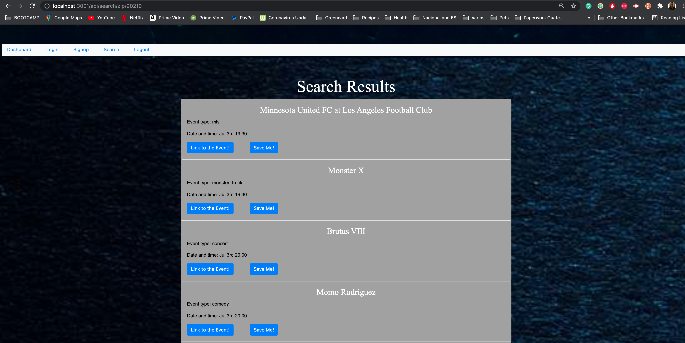

# Event Organizer  
  
  
  
# Description  
  
This is a web application that utilizes MySQL, Handlebars, and several Node.js packages to deliver a live event search by Zipcode and save tool. The user can also use it to create and save their own events. Once the user has saved a searched event or a created event these will show up in their personal dashboard. 
  
## Deployed App link

https://gentle-reaches-60799.herokuapp.com/

## Screenshots of the App

  
  
  
# Table of Contents

* [Installation](#installation)
    
* [Usage](#usage)

* [License](#license)

* [Contributors](#contributors)

* [Technology](#technology)

* [Questions](#questions)
  
# Installation  
  
Simply install Node.js, open the terminal, run 'npm install' and then 'npm start' from the directory command line. The local host version can then be accessed via browser at http://localhost:3001. Or just visit the link to the deployed app on Heroku in the [Usage](#usage) section below and sidestep installation altogether!  
  
## Usage  
  
Once the application is called by typing 'npm start' in the terminal, the user can load the app in their browser with the localhost:3001 address, click the signup link, and create an account to search for an event by zipcode and save it or create their own.  
 
 
Visit the deployed app in the following link: https://gentle-reaches-60799.herokuapp.com/

# License

This project is governed by: MIT License
  
## Contributors 
  
* Blenda Orellana
* Chao Ly
* Karina Clausen
* Samuel Montague
* Neil Burt  

# Technology

* NodeJs
* Express
* MySQL
* bcrypt
* Insomnia/Postman
* Handlebars
* Sequelize
* CSS3
* JavaScript ES6+
* SeatGeek API

  
# Questions  
  
If you have any additional questions:  
  
Visit our GitHub profiles:  
[Blenda Orellana](https://github.com/blen90)  
[Chao Ly](https://github.com/Chaoly123)  
[Karina Clausen](https://github.com/Karina5151)  
[Samuel Montague](https://github.com/SamuelMontague)  
[Neil Burt](https://github.com/neilburt)  
  
Or you can email us:  
[Blenda Orellana](mailto:blen.or90@gmail.com)  
[Chao Ly](mailto:lychaos123gmail.com)  
[Karina Clausen](mailto:karina.clausen.11@gmail.com)  
[Samuel Montague](mailto:Samuelpmontague@gmail.com)  
[Neil Burt](mailto:neil.burt@comcast.net)  
